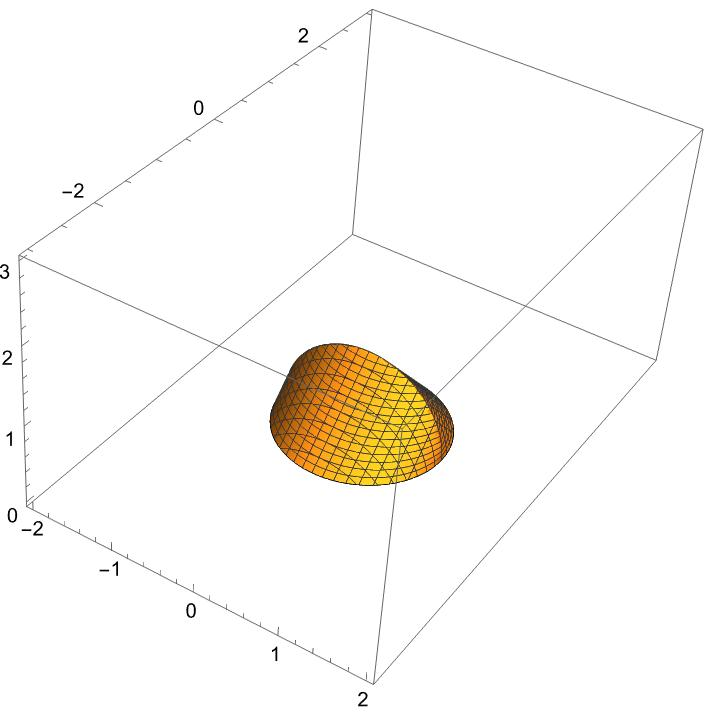
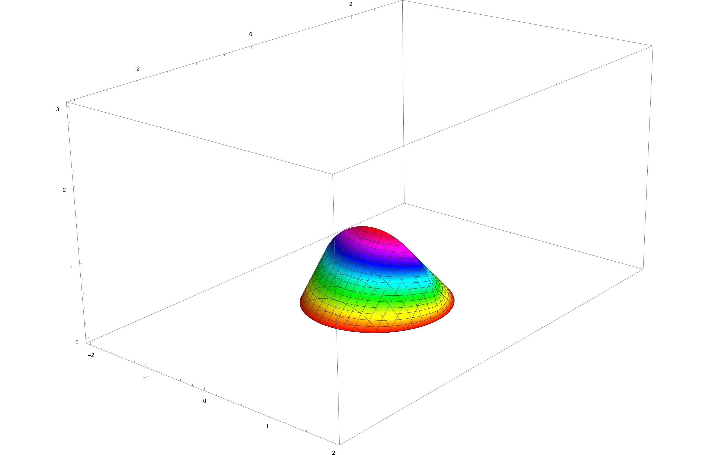

# 3D Plotting in Mathematica

This document explains how to create 3D plots in Mathematica for two specific regions with distinct geometric characteristics.

## Region 1: Triangular Base with Semicircular Cross-Sections

### Description
- **Base Shape**: The base of the solid \(S\) is a triangular region in the \(x-y\) plane, defined by the vertices \((0,0)\), \((3,0)\), and \((0,2)\).
- **Cross-Sections**: Cross-sections perpendicular to the \(y\)-axis are semicircles, extending upward in the \(z\)-direction.

### Mathematica Code
To visualize this structure, you would typically need to use a combination of plotting functions to create the triangular base and then overlay semicircular cross-sections. However, a direct approach using `ContourPlot3D` for this specific geometry is not straightforward due to its complexity.

## Region 2: Elliptical Base with Isosceles Right Triangle Cross-Sections

### Description
- **Base Shape**: The base of the solid \(S\) in the \(x-y\) plane is an elliptical region with the boundary curve defined by \(9x^2 + 4y^2 = 36\).
- **Cross-Sections**: Cross-sections perpendicular to the \(x\)-axis are isosceles right triangles, with the hypotenuse lying in the base plane and extending upward in the \(z\)-direction.

### Mathematica Code
For the elliptical base, you can visualize the ellipse using `ContourPlot` for the \(x-y\) plane. To add the isosceles right triangle cross-sections, you would need to creatively use Mathematica's 3D plotting capabilities, possibly through parametric definitions or manual layering of shapes.

```mathematica
ellipsePlot = ContourPlot[9 x^2 + 4 y^2 == 36, {x, -3, 3}, {y, -3, 3}, FrameLabel -> {x, y}];
```
## 3D Plot Image

Below is the image of the 3D plot as discussed in the guide:




## Additional Mathematica Code Snippet

For a specific visualization task, the following Mathematica code was provided to generate a 3D contour plot:

```mathematica
plot = ContourPlot3D[
   x^2 + (Abs[y] + z)^2 == 1, {x, -2, 2}, {y, -3, 3}, {z, 0, 3}, 
   BoxRatios -> Automatic];
```


## 3D Plot Image

Below is the image of the 3D plot as discussed in the guide:




This code snippet creates a 3D contour plot based on the equation \(x^2 + (\lvert y 
vert + z)^2 = 1\), illustrating a complex geometric shape within the specified ranges for \(x\), \(y\), and \(z\). The `BoxRatios -> Automatic` option adjusts the aspect ratio of the plot box automatically to fit the shape of the plot.

## 3D Printing the Generated Shape

The shape generated by the Mathematica code snippet can also be prepared for 3D printing. After creating the plot with the `ContourPlot3D` function, you can export this plot to an STL file, which is a widely used format for 3D printing. Here's how you can do it in Mathematica:

```mathematica
plot = ContourPlot3D[
   x^2 + (Abs[y] + z)^2 == 1, {x, -2, 2}, {y, -3, 3}, {z, 0, 3}, 
   BoxRatios -> Automatic];

(* Export the plot as an STL file *)
Export["path/to/your/filename.stl", plot];
```

Replace `"path/to/your/filename.stl"` with the actual path and filename where you want to save the STL file. This file can then be used with 3D printing software to print the shape.

- [You can check this link for the first part](https://mathematica.stackexchange.com/questions/136237/construction-of-a-special-region) on Mathematica Stack Exchange.
