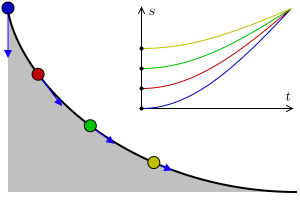

# Brachistochrone curve and Tautochrone curve

## Brachistochrone curve



The Brachistochrone curve, derived from the Greek words "brachistos" (meaning shortest) and "chronos" (meaning time), represents the path along which a particle will descend between two points in the least amount of time under the influence of gravity alone. The problem of finding this curve dates back to the late 17th century and was famously solved by Johann Bernoulli in 1696 as part of a challenge posed by his brother Jacob.

##### Historical Significance:

The Brachistochrone problem sparked considerable interest among mathematicians and physicists of the time, as it presented a challenging optimization question with real-world applications. Johann Bernoulli's solution not only showcased the power of calculus but also laid the groundwork for the development of variational calculus, a branch of mathematics concerned with finding the function that minimizes or maximizes a certain quantity.

##### Relevance in Calculus and Physics:

The Brachistochrone curve is a fundamental concept in calculus, illustrating the principles of optimization and the use of differential equations to solve real-world problems. By studying the Brachistochrone problem, students gain insights into the application of calculus in physics, particularly in the areas of mechanics and classical dynamics.

Understanding the Brachistochrone curve allows us to:

- Explore the relationship between time, distance, and gravitational forces.
    
- Apply the principle of least action to determine the path of least resistance.
    
- Investigate the properties of curves and surfaces that optimize various criteria.
    

The Brachistochrone problem serves as a gateway to deeper exploration of optimization theory, variational calculus, and the rich interplay between mathematics and the physical world.

For further exploration, you can visit the [Wikipedia page on the Brachistochrone curve](https://en.wikipedia.org/wiki/Brachistochrone_curve), which provides additional historical context, mathematical details, and related concepts.

#####   Brachistochrone Equations

The parametric equations for the Brachistochrone curve in markdown format:

```

x(t) = a(t - sin(t))

y(t) = a(1 - cos(t))

```

where `t` varies from `0` to `π`, and `a` is a scaling factor representing the amplitude of the curve.

Use these parametric equations to create a 2D representation of the Brachistochrone curve in software like ([Desmos](https://www.desmos.com), Mathematica, or [GeoGebra](https://www.geogebra.org/?lang=en). Experiment with different values of `a` to observe how it affects the shape and characteristics of the curve.**


**Comparison Curve:**

To further explore the concept of optimal paths, you need to  create multiple curve or path ( no more than 4 in total) for comparison with the Brachistochrone curve. This additional curve could be of their choosing, and they should analyze and compare its properties and characteristics to those of the Brachistochrone curve.

**Desmos Resource:**

For students interested in exploring the Brachistochrone curve further and visualizing it dynamically, they can use the following [Desmos](https://www.desmos.com/calculator/wzoaxtwjok), which generates the Brachistochrone curve based on the provided equations.


##  Tautochrone curve


The Tautochrone curve, derived from the Greek words "tauto" (meaning same) and "chronos" (meaning time), represents a curve along which a particle will descend from any point to the lowest point in the same amount of time, regardless of the starting position. The problem of finding this curve was also solved by Johann Bernoulli around the same time as the Brachistochrone problem.

**Historical Significance:**

Similar to the Brachistochrone problem, the Tautochrone problem challenged mathematicians and physicists of the time, leading to significant advancements in calculus and mechanics. Johann Bernoulli's solution of the Tautochrone problem further demonstrated the power of mathematical analysis in solving complex physical problems.

**Relevance in Calculus and Physics:**

The Tautochrone curve illustrates fundamental principles in calculus and physics, particularly the concept of isochronism - where a system or process takes the same amount of time regardless of its initial conditions. By studying the Tautochrone curve, students gain insights into the principles of conservation of energy, harmonic motion, and the cycloidal path.

Understanding the Tautochrone curve allows us to:
- Explore the concept of isochronism and its applications in mechanics.
- Investigate the relationship between energy, velocity, and path in simple harmonic motion.
- Apply mathematical techniques to solve problems of motion and time optimization.

**Desmos Resource:**

For exploring the Tautochrone curve further and visualizing it dynamically, you can use the following [Desmos calculator](https://www.desmos.com/calculator/cz6cbiexk0), which generates the Tautochrone curve based on the provided equations.

The Tautochrone problem offers a complementary perspective to the Brachistochrone problem, highlighting different aspects of time optimization and mathematical analysis in physics.

For further exploration, you can visit the [Wikipedia page on the Tautochrone curve](https://en.wikipedia.org/wiki/Tautochrone_curve), which provides additional historical context, mathematical details, and related concepts


**Guidelines:**

1. **Creating the Curves:**
   - Use software like Desmos, Mathematica, or GeoGebra to generate the parametric equations for the Brachistochrone or Tautochrone curves.
   - Plot and visualize the curves to ensure accuracy.

2. **Saving as SVG:**
   - Once the curves are created, save them as SVG (Scalable Vector Graphics) files.
   - SVG format preserves the vector-based representation of the curves, essential for importing into 3D modeling software.

3. **Creating the 3D Model:**
   - Import the SVG files into 3D modeling software such as Tinkercad or Fusion 360, or any other 3D modeling program.
   - Use appropriate tools to create the 2d shape first such as **spline** and then  extrude or loft the 2D curves, creating 3D models.


4. **Downloading as STL:**
   - After creating the 3D models, export them as STL files.
   - Open the STL files in Bambu Lab Studio.
   - In Bambu Lab Studio, choose filament and printing settings.
   - Finally, save the 3D model as a 3MF file and send it to my email or team channel.


