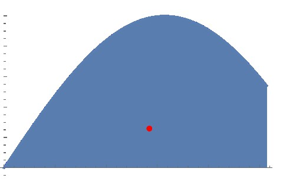

```mathematica
(*Define the function and limits*)f[x_] := Sin[x];
a = 0;
b = Pi/2 + 1;

(*Define the region under the curve and above the x-axis for the \
centroid calculation*)
region = 
  ImplicitRegion[y <= f[x] && y >= 0, {{x, a, b}, {y, 0, f[b]}}];

(*Calculate the centroid of the region*)
centroid = RegionCentroid[region];

(*Create the plot*)
plot = Show[
  Plot[f[x], {x, a, b}, Filling -> Axis, 
   PlotLabel -> "Shape with its Centroid", PlotRange -> Automatic], 
  Graphics[{Red, PointSize[Large], Point[centroid]}]]

(*Export the plot as an SVG file*)
Export["shape_and_centroid2.svg", plot]
```


Now, you have the option to import this SVG file into your favorite 3D modeling software, such as Onshape, Fusion 360, or Tinkercad. From there, you can easily create a 3D model, export it as an STL file, and get it ready for printing.
