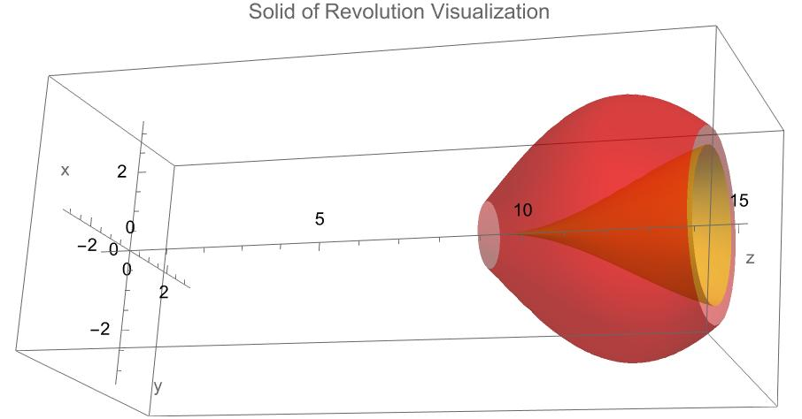
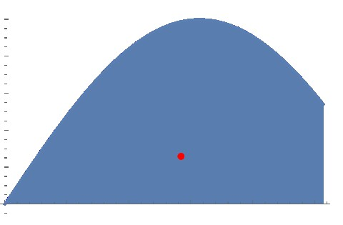
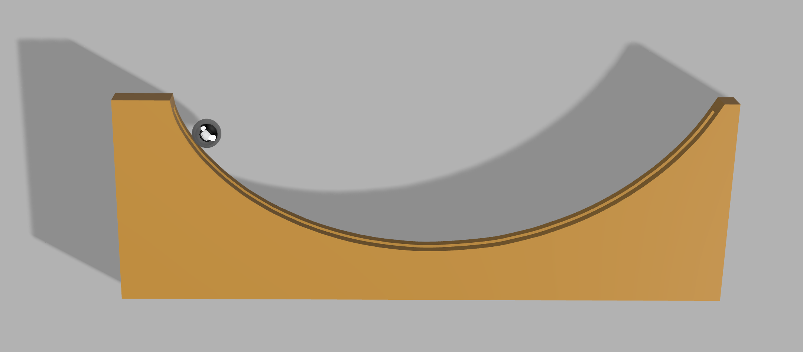
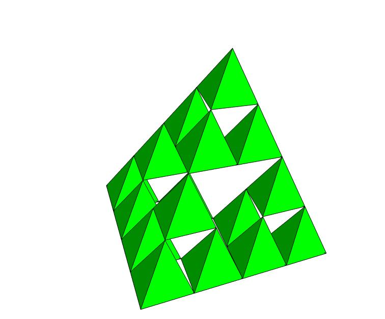

# 3D Printing and Calculus Applications - Spring 2024

Welcome to the GitHub repository for the 3D printing segment of our Honors Calculus 2 course at Montgomery College! This course uniquely integrates calculus concepts with 3D printing, specifically using the Bambu Lab Carbon X1. This repository is an open resource for sharing materials, designs, and ideas related to calculus and 3D printing.

## Course Description (under construction )

## Instructor Information

- **Name:** Rebin Muhammad
- **Email:** rebin.muhammad@montgomerycollege.edu

  
## Projects and Materials

### [Riemann Sum Visualization with 3D Printing](RiemannSum.md)

LeftRiemannSum3DPlotter.m
- **Objective:** Understand Riemann sums through 3D printed models.
- **Tools:** Mathematica for calculations and  3D modeling, and the Bambu Lab slicer for preparing models for printing on the Bambu Carbon X1.

### [Volume of Revolution and Disk Method](Volume_of_Revolution.md)
- **Objective:** Understand the calculation of volumes of solids obtained by rotating a plane area around an axis.
- **Tools:** Utilize Mathematica for calculating the volumes and OpenSCAD for visualizing and 3D printing these solids.

### [Washer Method and Vase](Washer_and_Desk.md)
- **Objective:** Explore the concepts of washer and disk methods for calculating volumes of solids of revolution.
- **Tools:** Use OpenSCAD to create models representing solids formed by these methods, and Mathematica for the calculations.

### [Centroid](CenterofMass.md)
- **Objective:** Apply calculus to find the center of mass in 3D models and print these models for physical examination.
- **Tools:** Mathematica for analysis, OpenSCAD for modeling, and the Bambu Lab slicer for 3D printing.

### [Brachistochrone curve and Tautochrone curve](Brachistochrone_Tautochrone.md)

- **Objective:** Utilize 3D printing to visualize mathematical curves such as the Brachistochrone and Tautochrone curves.
- **Tools:** Generate parametric equations using Desmos, Mathematica, or GeoGebra. Convert curves to 3D models in Tinkercad, Fusion 360, or other modeling software. Print using Bambu Lab Studio slicer.

### [Nested Shapes and Infinite Series](infinite_series.md)
- **Objective:** Explore infinite series via 3D printed nested geometric shapes.
- **Tools:** Design and  mathematical analysis in Mathematica, and printing using the Bambu Lab slicer.

## Nested Square Area

## Sierpinski Area

## 3D Sierpinski Volume

## Resources

- **Bambu Lab Slicer and Carbon X1:** Download and learn more about the Bambu Lab slicer for the Carbon X1 at [Bambu Lab Download Page](https://bambulab.com/en/download).
- **OpenSCAD:** Download OpenSCAD for creating 3D models at [OpenSCAD Downloads](https://openscad.org/downloads.html).
- **Mathematica:** Get a trial of Mathematica for complex calculations and visualizations at [Wolfram Mathematica Trial](https://www.wolfram.com/mathematica/trial/).

## Collaboration and Contribution

- We invite contributions, especially those involving innovative uses of the Bambu Lab slicer in calculus-related 3D printing projects.
- For contributions or discussions, use the repository's Issues and Pull Requests sections.

## Community Engagement

- Share your experiences, challenges, and triumphs in using the Bambu Lab slicer and Carbon X1 for your calculus and 3D printing projects.
- This is a space for learning from each other and pushing the boundaries of what we can create at the intersection of mathematics and 3D printing.

---

Join us in this exciting journey of blending advanced calculus concepts with the state-of-the-art Bambu Lab 3D printing technology!

Dr. Rebin Muhammad
