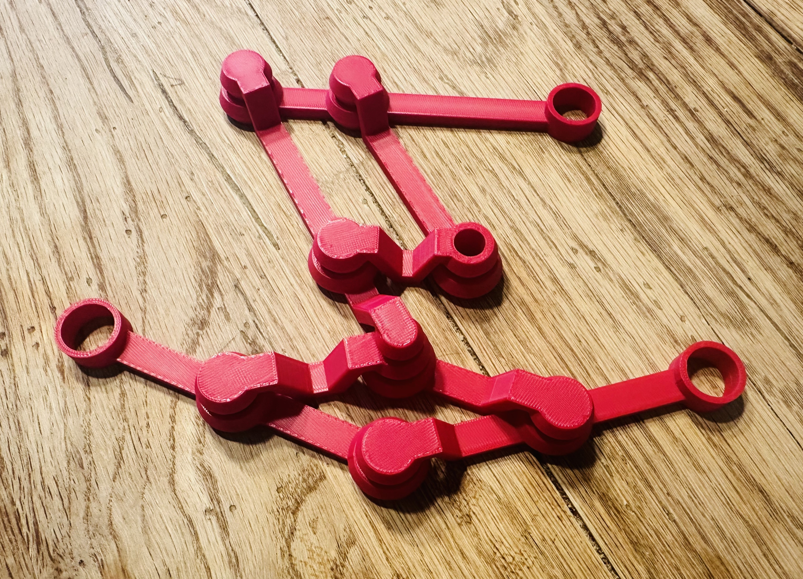

### Resources 


1. [Centroid finder print-in-place](https://www.printables.com/model/671673-centroid-finder-print-in-place) Center of Mass of Triangle.


2. [Plot cross sections, this good exmaple for volumn in calclus 2](https://mathematica.stackexchange.com/questions/18849/plot-cross-sections-of-a-function)
   
  ``` mathematica
   ParametricPlot3D[{v {u, Sin[u], 0} + (1 - v) {u, -Sin[u], 0},
  ConditionalExpression[v {u, Sin[u], 0} + (1 - v) {u, 0, Sin[u]},  0 <= u <= Pi],
  ConditionalExpression[v {u, -Sin[u], 0} + (1 - v) {u, 0, Sin[u]}, 0 <= u <= Pi],
  {u, 0, Sin[u]}},
  {u, -1, 4}, {v, 0, 1},
  PlotStyle -> Opacity[.5, White], Lighting -> "Neutral",
  Boxed -> False, Axes -> True, BoxRatios -> {2, 1, 1},
  MeshFunctions -> {Function[{x, y, z, u, v}, u], Function[{x, y, z, u, v}, v]},
  Mesh -> {Range[0, Pi, Pi/4], {0, 1}},
  MeshStyle -> {Directive[Dashed, Red], Directive[Thick, Blue]},
  PlotRange -> Full, ImageSize -> 500, AxesOrigin -> {0, 0, 0},
  Ticks -> {{Pi/2, Pi}, {-1/2, -1}, {1/2, 1}},
  PlotRangePadding -> .2,  AxesStyle -> Thick, ImageSize -> 500]
  ``` 

