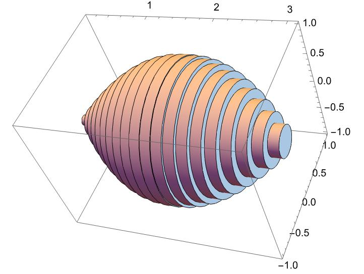
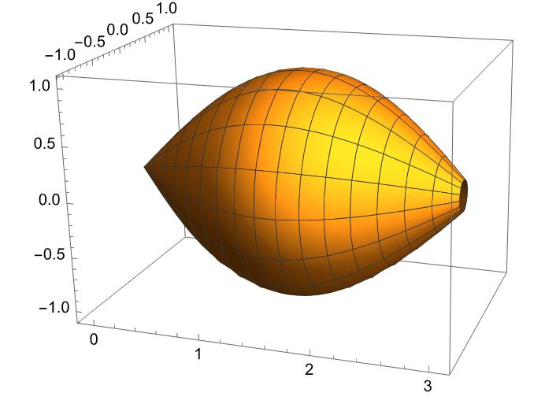

### Solid of Revolution Visualization

This Mathematica script defines the function `plotSolidOfRevolution`, designed to visualize and calculate the volume of a solid of revolution generated by rotating a given function `f` over an interval `[a, b]` around the x-axis. It supports two visualization modes: using cylindrical shells and representing the solid itself. Moreover, the function offers two approaches for calculating the volume of the solid:

- An **approximation** using the method of cylindrical shells, ideal for visual understanding and educational purposes.
- The **exact volume**, calculated via direct integration with `NIntegrate`.

#### Volume Calculation Formulas

The volume of the solid of revolution is determined by the integral:

$$ V = \pi \int_{a}^{b} [f(x)]^2 dx $$

This formula calculates the exact volume of the solid formed by rotating the curve `f(x)` around the x-axis, from `x=a` to `x=b`.

For the **approximation** using cylindrical shells, the volume is approximated by:


```math
 V_{\text{approx}} = 2\pi \sum_{i=1}^{n} f(x_i^*) x_i^* \Delta x
```


where `Δx_i` is the width of each shell, and `x_i^*` is a representative point within the ith interval. This method provides an intuitive geometric interpretation and a practical approach for approximation, especially useful in educational contexts.

#### Mathematica Implementation


```mathematica
(*Define the function,range,and number of disks*)f[x_] := Sin[x];
a = 0;
b = 3;
n = 20; (*Increase n for a finer approximation*)

(*Generate the disks*)
disks = Table[
   With[{x = a + (i - 0.5)*((b - a)/n), 
     r = f[a + (i - 0.5)*((b - a)/n)]}, {Cylinder[{{x, 0, 
        0}, {x + (b - a)/n, 0, 0}}, r]}], {i, 1, n}];

(*Combine the disks into one graphics object*)
solid = Graphics3D[Flatten@disks, Axes -> True, Boxed -> True];

(*Display the solid*)
solid

(*Export to STL*)
Export["volumeOfRevolution.stl", solid];
```
### Visualization of Solids of Revolution using $f(x) = \sqrt{x}$ over $[0, 2\pi]$

Below are two visualizations demonstrating the application of different methods to approximate and calculate the volume of a solid of revolution for the function $f(x) = \sqrt{x}$ over the interval $[0, 2\pi]$.

*Approximation using the cylindrical shells method.*
!


```mathematica

(* Generate a 3D plot of the revolution of Sin[t] around the x-axis over the interval from t=0 to t=3 *)
T = RevolutionPlot3D[Sin[t], {t, 0, 3}, RevolutionAxis -> {1, 0, 0}];

(* Export the generated 3D plot to an STL file named "test_closed.stl" *)
Export["test_closed.stl", T];

```

*Exact volume calculation using the solid of revolution method.*



These images showcase the difference between approximation techniques and exact calculations in the study of solids of revolution, providing a visual understanding of the concepts involved.


