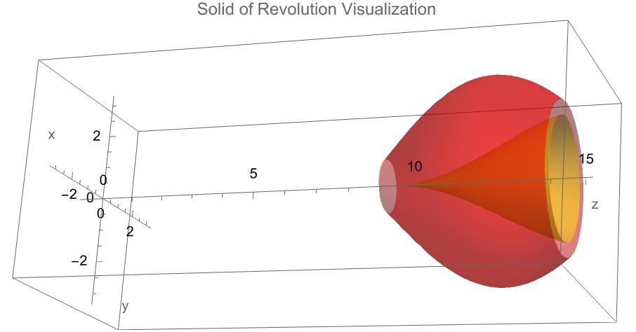

### Washer Method for Volume of Revolution Visualization

This Mathematica script outlines the procedure for visualizing and calculating the volume of a solid of revolution generated by rotating the area between two functions `f(x)` and `g(x)` around the x-axis. This process creates a solid consisting of a series of washers, which are essentially donut-shaped slices. The script supports generating a 3D model of this solid, suitable for educational purposes and detailed visual analysis. It also allows for the export of this model as an STL file, enabling 3D printing or further manipulation in CAD software.

#### Conceptual Overview

The volume between two curves rotated around the x-axis can be visualized as a series of washers. Each washer has an outer radius `rOuter` determined by `f(x)` and an inner radius `rInner` determined by `g(x)`. The volume of each washer can be thought of as the volume of a cylinder (formed by the outer function) minus the volume of the cylinder formed by the inner function.

#### Volume Calculation Formula

The exact volume of the solid formed by rotating the area between `f(x)` and `g(x)` around the x-axis is given by the integral:

$$
V = \pi \int_{a}^{b} ([f(x)]^2 - [g(x)]^2) dx
$$

This formula calculates the exact volume by integrating the difference in the squares of the functions over the interval `[a, b]`.

#### Mathematica Implementation

```mathematica
(*Define the functions*)f[x_] := Sin[x/2] + 1;
g[x_] := 2  Cos[x/2] + 1;

(*Visualization for outer function f[x]*)
outer = RevolutionPlot3D[{f[x], x}, {x, 9.2, 14.4}, 
   PlotStyle -> {Opacity[0.5], Yellow}, AxesLabel -> {"x", "y", "z"}, 
   Mesh -> None, PlotRange -> All];

(*Visualization for inner function g[x]*)
inner = RevolutionPlot3D[{g[x], x}, {x, 9.2, 14.4}, 
   PlotStyle -> {Opacity[0.5], Red}, Mesh -> None, PlotRange -> All];

(*Combine the plots to visualize the solid of revolution*)
(*Adjusting PlotRange to show from x=6 to x=16*)
combined = 
 Show[outer, inner, PlotRange -> Automatic, AxesOrigin -> {0, 0, 0}, 
  PlotLabel -> "Solid of Revolution Visualization"]
```
!
