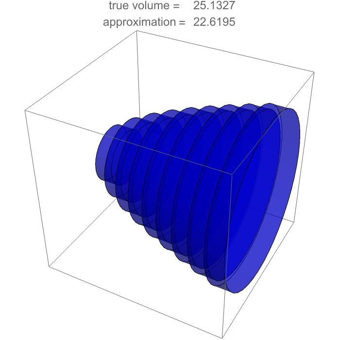
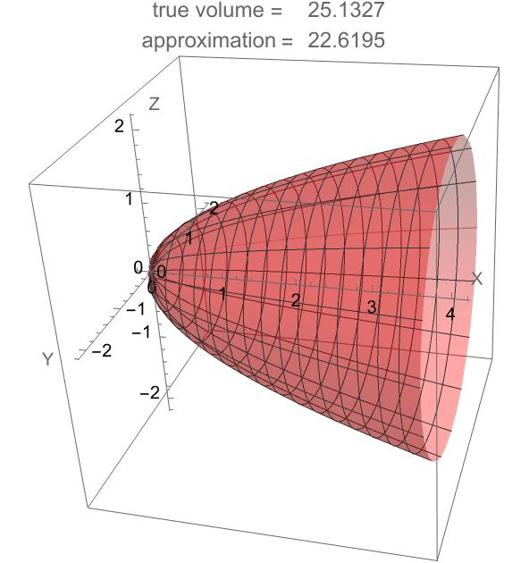

### Solid of Revolution Visualization

This Mathematica script defines the function `plotSolidOfRevolution`, designed to visualize and calculate the volume of a solid of revolution generated by rotating a given function `f` over an interval `[a, b]` around the x-axis. It supports two visualization modes: using cylindrical shells and representing the solid itself. Moreover, the function offers two approaches for calculating the volume of the solid:

- An **approximation** using the method of cylindrical shells, ideal for visual understanding and educational purposes.
- The **exact volume**, calculated via direct integration with `NIntegrate`.

#### Volume Calculation Formulas

The volume of the solid of revolution is determined by the integral:

$$ V = \pi \int_{a}^{b} [f(x)]^2 dx $$

This formula calculates the exact volume of the solid formed by rotating the curve `f(x)` around the x-axis, from `x=a` to `x=b`.

For the **approximation** using cylindrical shells, the volume is approximated by:


$$  V_{\text{approx}} = 2\pi \sum_{i=1}^{n} f(x_i^*) x_i^* \Delta x $$ 


where `Δx_i` is the width of each shell, and `x_i^*` is a representative point within the ith interval. This method provides an intuitive geometric interpretation and a practical approach for approximation, especially useful in educational contexts.

#### Mathematica Implementation


```mathematica
(* Define a function to plot the solid of revolution, cylindrical shells, or both, for a given function f over an interval [a, b]. 
   The type of plot (solid, shells, or both) can be specified. 
   The function also calculates the volume of the solid of revolution. *)
plotSolidOfRevolution[f_, a_, b_, theta_, n_, plotType_: "both"] := Module[
  {dx, vol, cc1, solid, volume, plotElements},

  dx = (b - a)/n;
  vol = N[Pi*Sum[f[a + (i - 1)*dx]^2*dx, {i, 1, n}]];
  volume = NIntegrate[Pi*f[x]^2, {x, a, b}];

  cc1 = Graphics3D[{Blue, Opacity[0.5], 
    Table[Cylinder[{{a + (i - 1)*dx, 0, 0}, {a + i*dx, 0, 0}}, 
      Abs[f[a + (i - 1)*dx]]], {i, 1, n}]}, Boxed -> True];
  
  solid = ParametricPlot3D[{x, f[x]*Cos[y], f[x]*Sin[y]}, {x, a, b}, 
    {y, 0, theta + .01}, PlotStyle -> {Red, Opacity[0.35]}];

  (* Determine which elements to include in the plot based on the plotType argument *)
  plotElements = Switch[plotType,
    "solid", {solid},
    "shells", {cc1},
    _, {cc1, solid}
  ];

  Show[plotElements, AxesLabel -> {"X", "Y", "Z"}, 
    AxesOrigin -> {0, 0, 0}, 
    PlotLabel -> Grid[{{"true volume = ", volume}, {"approximation = ", vol}}], 
    ImageSize -> {350, 350}, PlotRange -> All]
];

(* Example usage: plotSolidOfRevolution[Sqrt, 0, 4, 2*Pi, 10, "solid"] *) 
```
### Visualization of Solids of Revolution using $f(x) = \sqrt{x}$ over $[0, 2\pi]$

Below are two visualizations demonstrating the application of different methods to approximate and calculate the volume of a solid of revolution for the function $f(x) = \sqrt{x}$ over the interval $[0, 2\pi]$.

*Approximation using the cylindrical shells method.*


*Exact volume calculation using the solid of revolution method.*



These images showcase the difference between approximation techniques and exact calculations in the study of solids of revolution, providing a visual understanding of the concepts involved.


