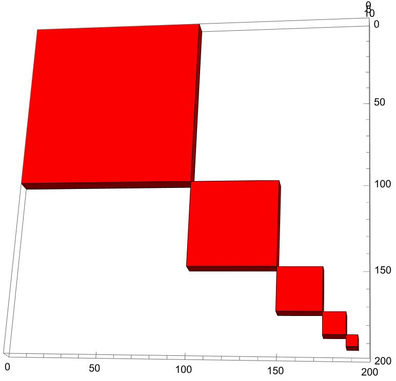
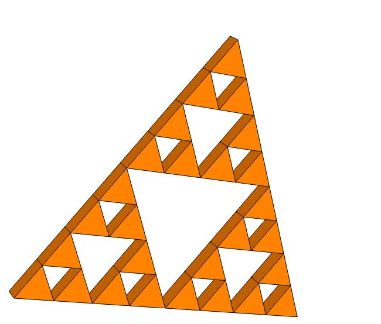
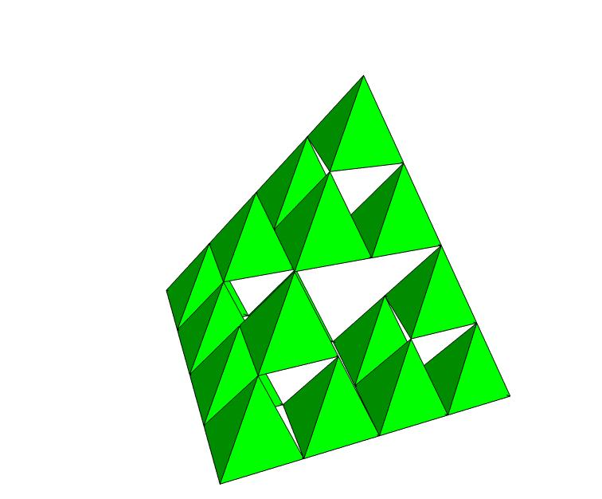

# Visualizing Infinite Series with 3D Nested Shapes

This document details a Mathematica function, `divideAndShade3DOnlyRed`, designed to visualize the concept of infinite series through the generation of nested 3D shapes. By recursively dividing a space and shading specific sections, we can create complex, visually appealing structures that can also be used to discuss mathematical concepts such as recursion, fractals, and the infinite series in a 3D space. This approach not only aids in the understanding of abstract mathematical theories but also demonstrates the practical application of these concepts in 3D modeling and printing.

## Mathematica Code

The following Mathematica code snippet defines the `divideAndShade3DOnlyRed` function. This function takes a starting coordinate, the size of the initial cube, the desired depth for each nested shape, and the number of iterations (or depth of recursion) as its parameters. It then generates a 3D graphical representation of nested shapes, where only specific sections are shaded.

```mathematica
ClearAll[divideAndShade3DOnlyRed];
divideAndShade3DOnlyRed[coords_, size_, depth_, n_] := 
  Module[{half = size/2, shaded, bottomRight, thickness = depth}, 
    If[n == 0, Return[{}]];
    shaded = Cuboid[coords, coords + {half, half, thickness}]; (* Create depth only for shaded (red) area *)
    bottomRight = If[n > 1, divideAndShade3DOnlyRed[coords + {half, half, 0}, half, thickness, n - 1], {}];
    Flatten[{{Red, shaded}, bottomRight}]
  ];

Graphics3D[
  divideAndShade3DOnlyRed[{0, 0, 0}, 200, 10, 5], (* Adjust '10' to change the depth as needed *)
  PlotRange -> {{0, 200}, {0, 200}, {0, 10}}, (* Ensure PlotRange accommodates the new depth *)
  Axes -> True
]
```

### [Nested Shapes and Infinite Series]()
- **Objective:** Explore infinite series via 3D printed nested geometric shapes.
- **Tools:** Design and  mathematical analysis in Mathematica, and printing using the Bambu Lab slicer.




### Sierpinski Trinagle 


```mathematica
(*Set the desired depth of the extrusion*)
extrusionDepth = 0.05;  (*Adjust this value to change the depth*)

(*Generate a 2D Sierpinski triangle mesh*)
sierpinski2D = SierpinskiMesh[3];

(*Create a line segment to represent the depth,using extrusionDepth \
for control*)
depth = MeshRegion[{{0}, {extrusionDepth}}, Line[{1, 2}]];

(*Use RegionProduct to extrude the 2D mesh into 3D by combining it \
with the depth line segment*)
sierpinski3D = RegionProduct[sierpinski2D, depth];

(*Visualize the 3D extruded Sierpinski triangle in orange*)
Graphics3D[{Orange, MeshPrimitives[sierpinski3D, 2]}, Boxed -> False, 
 Lighting -> "Neutral"]
```



## 3D Sierpinski 

```mathematica
(*Function to generate and position a 3D Sierpinski tetrahedron*)
generatePositionedSierpinski[depth_, offset_] := 
  Module[{mesh = SierpinskiMesh[depth, 3], transformation}, 
   transformation = TranslationTransform[{offset, 0, 0}];
   GeometricTransformation[mesh, transformation]];

(*Create a list of 3D Sierpinski tetrahedrons with increasing \
depth,positioned next to each other*)
sierpinskiTetrahedrons = 
  Table[generatePositionedSierpinski[n, 4*n], {n, 2, 
    2}]; (*Change the range from {n,0,2} to {n,2,2} for only the last \
step*)

(*Display the tetrahedrons in a row with green color*)
Graphics3D[{Green, Flatten[sierpinskiTetrahedrons]}, Boxed -> False, 
 Lighting -> "Neutral"]

```

